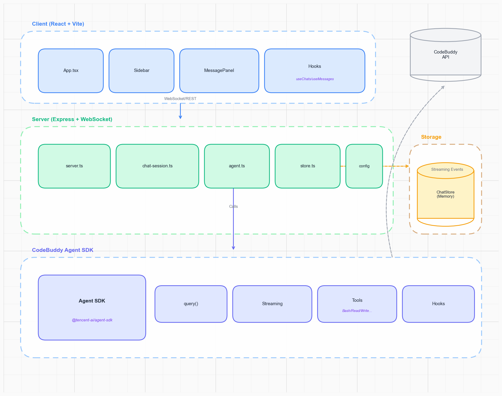

# 智能聊天演示

一个使用 CodeBuddy Agent SDK 的演示聊天应用，带有 React 前端和 Express 后端。



## 开始使用

### 前置条件

- Node.js 18+
- CodeBuddy Agent SDK 凭据（设置 `CODEBUDDY_API_KEY` 环境变量）

### 安装

```bash
npm install
```

### 运行

```bash
npm run dev
```

这将同时启动：
- **后端**（Express + WebSocket）在 http://localhost:3001
- **前端**（Vite + React）在 http://localhost:5173

在浏览器中打开 http://localhost:5173。

## 生产环境注意事项

这是一个用于演示目的的示例应用。对于生产使用，请考虑：

1. **隔离 Agent SDK** - 将 SDK 移到单独的容器/服务中。这提供更好的安全隔离，因为智能体可以访问 Bash、文件系统操作和网络请求等工具。

2. **持久化存储** - 用数据库替换内存中的 `ChatStore`。目前所有聊天在服务器重启时都会丢失。

3. **会话记录同步** - 为了使 Agent Sessions 在服务器重启后持久化，您需要持久化和恢复 SDK 的对话记录。SDK 维护多轮对话的内部状态，必须与您的存储同步。

4. **身份验证** - 添加用户身份验证和授权。目前任何人都可以访问任何聊天。

